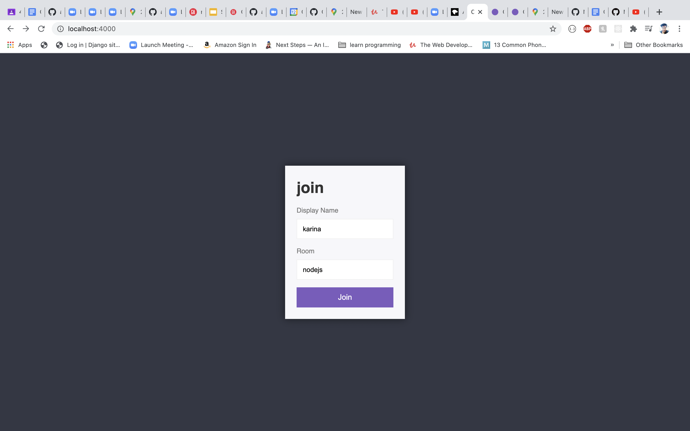
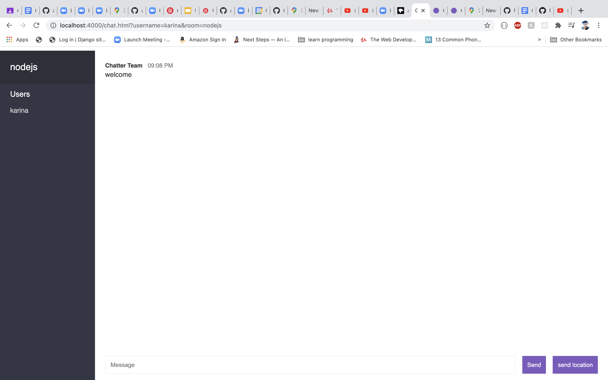

# chatter
Project Description:

chatter is a Real-time chat application where users will have the ability to create a virtual chat room, and they can interact with each other by sending text messages to each other in real time. From this application users can also send their location to the people that are already in the room. This can be used by the people who want to get in touch with Each other and make communication more fun and accessible.

USER STORIES
MVP STORIES:

As a user, At the home page I would have the ability to create a Username and Channel/Room name .
As a user, After completing the username and channel name, I should land in the main chat page.
As a user, I want to see how many users and how many people there are in the chat-room on the left side of the main chat room page.
As a user,  I should be able to type a message in the input box and send it to the chat room where other users who have joined the channel can see my message and interact. 
As a user, I would have the ability to send my location by just clicking the send location button at the bottom of the chat room.

STRETCH STORIES:

As a user, I want to send the pictures to the chat room.
As a user, I want to see the video calling option.
As a user, I want to delete the post that I have made in that specific chat room.
As a user, I want to send the different files in that chat room.
As a user, I want to see the different available chatroom in the home page to join.
As a user, I want to create a authentication part where user can join the available chatroom and is only allowed by the user who have create that chatroom.

Wire-Frame

Home Page:

Room page:

